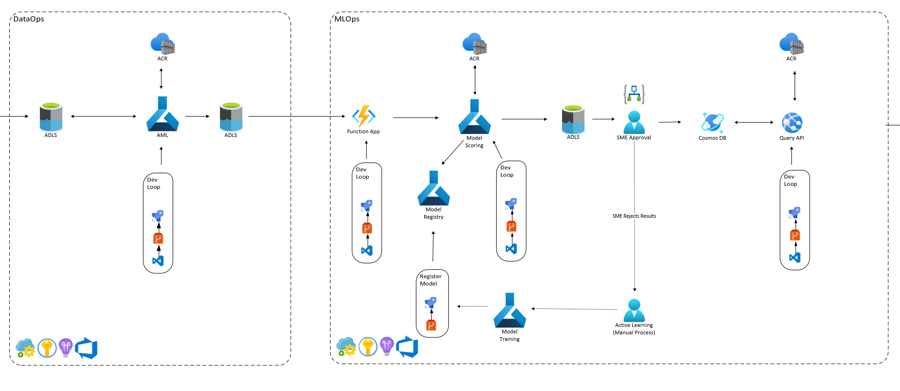

# ML Ops Pipeline

## Cloud Adoption Framework layered approach

For the MLOps solution we followed the Cloud Adoption Framework layered appraoch. For more information on how CAF uses the reference architecture in their landing zones check out the [Landingzone Repo](https://github.com/Azure/caf-terraform-landingzones/blob/master/documentation/code_architecture/intro_architecture.md)

### Level 0

Creates permissions to each level, the storage account where the terraform state is stored per resource group, creates each place holder resource group for each level, role mappsings, dynamic secrets, and various keyvaults

### Level 1

We do not have any specific configuration for level 1 and use the generic level one landing zones as a passthrough

### Level 2

### Level 3

## Setting up your environment

See [Starter Repo](https://github.com/cse-kratos/caf-terraform-landingzones-starter) to create your shell repo then within each level in this repo will tell you how to deploy each level
